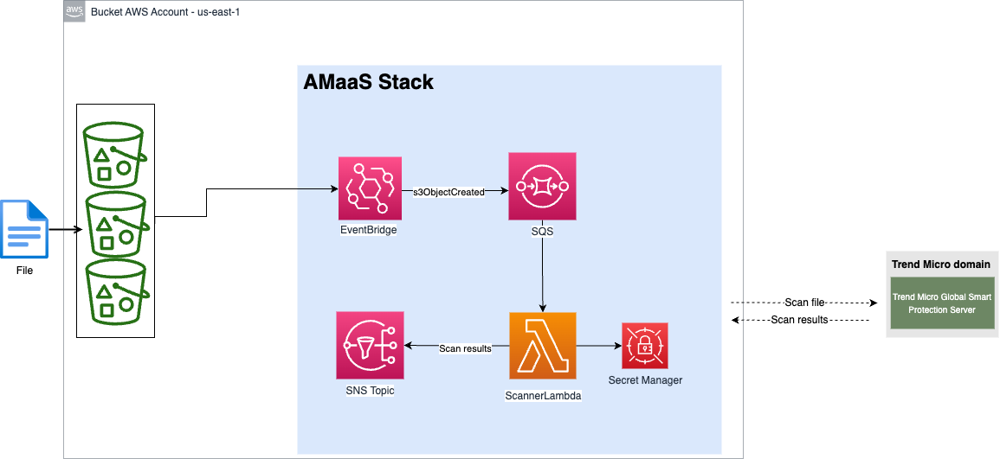

# AMaaS Stack example

This example shows how to use the [AMaaS Python SDK](https://github.com/trendmicro/cloudone-antimalware-python-sdk/) to create a new stack that automatically scan files uploaded to an S3 bucket.

## Requirements

- Have a [Cloud One](https://www.trendmicro.com/cloudone) account. [Sign up for a free trial now](https://cloudone.trendmicro.com/register) if it's not already the case!
- An [API key](https://cloudone.trendmicro.com/docs/account-and-user-management/c1-api-key/#create-a-new-api-key) with **"Full Access"** permission;
- Terraform CLI [installed](https://learn.hashicorp.com/tutorials/terraform/install-cli#install-terraform)
- AWS CLI [installed](https://docs.aws.amazon.com/cli/latest/userguide/getting-started-install.html) and [configured](https://docs.aws.amazon.com/cli/latest/userguide/cli-chap-configure.html).

## Before you start

****IMPORTANT****
This is an example of how to use the AMaaS Python SDK to scan files uploaded to an S3 bucket. The example is not intended to be used in production, it is just a way to show how to use the SDK.

This Stack creates the following resources:
- 1x EventBridge rule
- 1x Lambda function + 1x Lambda layer
- 1x IAM role and policies
- 1x SQS queue
- 1x SNS topic
- 1x Secrets Manager secret (To store the Cloud One API key)



The architecture is triggered every time that a file is uploaded to a S3 bucket, that happen only in the aws region where the bucket is located and for the eventbridge is trigger the s3 bucket must have the event notification for eventbridge enabled.

The notification then is sent to a SQS queue and a lambda function is trigger to process the message. The lambda function will download the file from the S3 bucket and use the AMaaS Python SDK to scan the file. The result of the scan is publish to a SNS topic.

The SNS topic can be used to send the notification to a email, slack, etc.

The way that the stack was build give you the flexibility to customize the stack to your needs. For example, you can change the way that the notification is sent to SNS, you can change the way that the notification is sent to the email, slack, etc.

The Stack work on any regions where the resources described above are available.

## Usage

To build and deploy the stack, follow the steps below:

- Clone this repository
- Execute the following commands:

    ```
    cd terraform
    terraform init
    terraform plan
    terraform apply -auto-approve
    ```

*The stack takes in average 1 minute to be deployed and 50 seconds to be destroyed.*

## Testing

To test the stack, you can copy/upload a file to any s3 bucket in the same region where the stack was deployed. An example of a file that you can use to test the stack is the [eicar test file](https://www.eicar.org/?page_id=3950).

To test the stack, you can use the following command:

```
aws s3 cp eicar.com s3://<bucket-name>
```

The result of the scan will be published to the SNS topic. You can subscribe to the SNS topic to receive the notification, a sample of the notification is below:

```
{
	'timestamp': '2023-05-24T21:19:00Z',
	'sqs_message_id': 'fa2bd59e-5e6d-4ac8-bfac-d849283bd8273',
	'xamz_request_id': '177cdce6-1fc6-632c-2654-4ab8b45d4400',
	'file_url': 'https://test-bucket.s3.ap-south-1.amazonaws.com/file.zip',
	'file_attributes': {
		'etag': '6ce6f415d87164jdsd114f208b0ff'
	},
	'scanner_status': 0,
	'scanner_status_message': 'successful scan',
	'scanning_result': {
		'TotalBytesOfFile': 184,
		'Findings': [{
			'version': '1.0.0',
			'scanResult': 1,
			'scanId': '249c3861-4a18-7826-b3e0-e0c44dbbe697',
			'scanTimestamp': '2023-05-24T21:19:04.826Z',
			'fileName': 'file.zip',
			'foundMalwares': [{
				'fileName': 'file.zip',
				'malwareName': 'OSX_EICAR.PFH'
			}],
			'scanDuration': '0.95s'
		}],
		'Error': '',
		'Codes': []
	},
	'source_ip': '111.220.222.22'
}
```

You can customize the message that is sent to the SNS topic by changing the lambda function code.

## Cleanup

To destroy the stack, execute the following command:

```
terraform destroy -auto-approve
```
