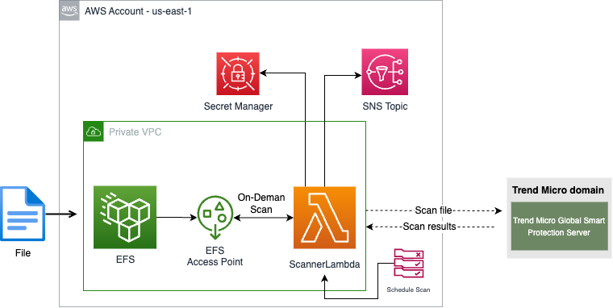

# EFS Scanner - AMaaS Stack example

This example shows how to use the [AMaaS Python SDK](https://github.com/trendmicro/cloudone-antimalware-python-sdk/) to create a new stack that automatically scan files uploaded to an S3 bucket.

## Requirements

- Have a [Cloud One](https://www.trendmicro.com/cloudone) account. [Sign up for a free trial now](https://cloudone.trendmicro.com/register) if it's not already the case!
- An [API key](https://cloudone.trendmicro.com/docs/account-and-user-management/c1-api-key/#create-a-new-api-key) with minimum **"Read Only Access"** permission;
- Terraform CLI [installed](https://learn.hashicorp.com/tutorials/terraform/install-cli#install-terraform)
- AWS CLI [installed](https://docs.aws.amazon.com/cli/latest/userguide/getting-started-install.html) and [configured](https://docs.aws.amazon.com/cli/latest/userguide/cli-chap-configure.html).

## Before you start

****IMPORTANT****
This is an example of how to use the AMaaS Python SDK to scan files in a EFS. The example is not intended to be used in production, it is just a way to show how to use the SDK.

This Stack creates the following **mandatory** resources:
- 1x Lambda function + 1x Lambda layer
- 1x IAM role and policies
- 1x SNS topic
- 1x Secrets Manager secret (To store the Cloud One API key)


**IMPORTANT: The lambda must be in the same VPC as the EFS and the lambda must have internet access to work**



The architecture is triggered manually when the lambda function is invoked. The lambda function access the file from the EFS and use the AMaaS Python SDK to scan the file. The result of the scan is publish to a SNS topic.

The Stack work on any regions where the resources described above are available.


## How the scan works

The AMaaS is a cloud service that is part of the Trend Cloud One platform, allowing you to scan files and determine whether they are malicious or not. The interaction with the AMaaS backend service is facilitated through an SDK that enables you to send files to the backend service. The backend service utilizes the Trend Micro Antimalware engine and the Trend Micro Smart Protection Network (SPN) for file scanning.

The AMaaS SDK Python library is available on [GitHub](https://github.com/trendmicro/cloudone-antimalware-python-sdk).

## Usage

To build and deploy the stack, follow the steps below:

- Clone this repository
- Execute the following commands:

    ```
    cd terraform
    terraform init
    terraform plan
    terraform apply -auto-approve
    ```

*The stack takes in average 3 minutes to be deployed and 50 seconds to be destroyed.*

## Testing

To test the stack, you can run a lambda test or invoke the lambda via CLI.
```
aws lambda invoke --function-name <lambda-function-name> --payload {"key1": "value1"}
```

The result of the scan will be published to the SNS topic. You can subscribe to the SNS topic to receive the notification, a sample of the notification is below:

```
{
   "/mnt/efs/test.png": {
      "version": "1.0.0",
      "scanResult": 0,
      "scanId": "075a4894-be4b-410d-8871-1de77e641ba1",
      "scanTimestamp": "2023-06-21T22:37:24.38Z",
      "fileName": "test.png",
      "foundMalwares": [],
      "scanDuration": "0.25s",
      "size": 36745
   },
   "/mnt/efs/test/test2/eicar.com": {
      "version": "1.0.0",
      "scanResult": 1,
      "scanId": "70f68a3c-eb59-450e-a8d8-976e63d045af",
      "scanTimestamp": "2023-06-21T22:37:25.96Z",
      "fileName": "eicar.com",
      "foundMalwares": [
         {
            "fileName": "eicar.com",
            "malwareName": "Eicar_test_file"
         }
      ],
      "scanDuration": "0.01s",
      "size": 68
   }
}
```

You can customize the message that is sent to the SNS topic by changing the lambda function code.

## Cleanup

To destroy the stack, execute the following command:

```
terraform destroy -auto-approve
```
