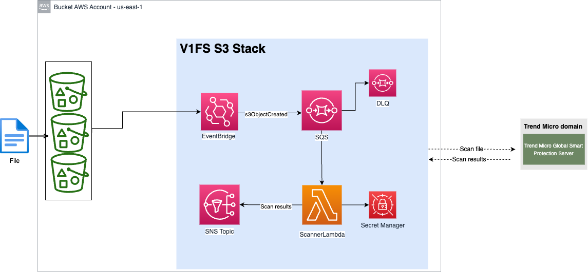
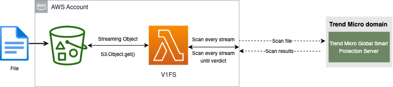

# V1FS SDK for S3 CloudFormation Deployment

This example demonstrates how to use the [V1FS Python SDK](https://github.com/trendmicro/tm-v1-fs-python-sdk) to automatically scan files uploaded to an S3 bucket using AWS CloudFormation.

## Table of Contents

- [Overview](#overview)
- [Architecture](#architecture)
- [Requirements](#requirements)
- [Quick Start](#quick-start)
- [Manual Deployment](#manual-deployment)
- [Configuration](#configuration)
- [S3 Bucket Setup](#s3-bucket-setup)
- [Multi-Region Deployment](#multi-region-deployment)
- [How Scanning Works](#how-scanning-works)
- [Testing](#testing)
- [Payload Structure](#payload-structure)
- [Troubleshooting](#troubleshooting)
- [Cleanup](#cleanup)

## Overview

This CloudFormation template creates an automated file scanning solution that:

- **Automatically scans** files uploaded to S3 buckets using Trend Micro Vision One File Security:SDK
- **Publishes scan results** to an SNS topic for integration with email, Slack, or other notification systems
- **Optionally tags** scanned objects with scan results
- **Supports** KMS-encrypted buckets, IAM Permission Boundaries and VPC deployments

## Architecture



### Flow

1. **File Upload**: A file is uploaded to an S3 bucket with EventBridge notifications enabled
2. **EventBridge**: Captures the S3 object creation event
3. **SQS Queue**: Receives the event message for reliable processing
4. **Lambda Scanner**: Processes the message, streams the file from S3, and scans it using V1FS SDK
5. **SNS Topic**: Publishes scan results for downstream processing
6. **Tag Lambda** (optional): Tags the S3 object with scan results

### Resources Created

**Mandatory Resources:**
- 1x EventBridge rule (captures S3 object creation events)
- 1x Lambda function (scanner) + 1x Lambda layer (V1FS SDK)
- 1x IAM role and policies
- 1x SQS queue (with DLQ for failed messages)
- 1x SNS topic
- 1x Secrets Manager secret (stores Vision One API key)

**Optional Resources:**
- Tag Lambda function (for S3 object tagging)
- KMS policies (for scanning encrypted files)
- VPC configurations (for Lambda in VPC)
- IAM Permission Boundaries

## Requirements

- [Vision One](https://www.trendmicro.com/visionone) account ([Sign up for a free trial](https://resources.trendmicro.com/vision-one-trial.html))
- [API key](https://docs.trendmicro.com/en-us/documentation/article/trend-vision-one-__api-keys-2) with V1FS **Run file scan via SDK** permissions
- AWS CLI [installed](https://docs.aws.amazon.com/cli/latest/userguide/getting-started-install.html) and [configured](https://docs.aws.amazon.com/cli/latest/userguide/cli-chap-configure.html)
- AWS account with permissions to create:
  - Lambda functions and layers
  - IAM roles and policies
  - SQS queues
  - SNS topics
  - EventBridge rules
  - Secrets Manager secrets

## Quick Start

### Step 1: Upload Lambda Code to S3

Run the upload script to package and upload Lambda functions:

```bash
./upload.sh
```

The script will:
- Package your Lambda functions into zip files
- Upload them to your specified S3 bucket
- Display the CloudFormation deployment command

**⚠️ Important:** Your S3 bucket must be in the **same region** where you're deploying the CloudFormation stack. Lambda layers cannot be created from S3 buckets in different regions.

### Step 2: Configure S3 Bucket EventBridge Notifications

Before deploying, you need to configure your S3 bucket to send events to EventBridge. You can do this via:

**AWS Console:**
1. Go to your S3 bucket → Properties → Event notifications
2. Enable "EventBridge" notifications
3. Save changes

**AWS CLI:**
```bash
aws s3api put-bucket-notification-configuration \
  --bucket your-bucket-name \
  --notification-configuration '{"EventBridgeConfiguration":{}}'
```

**Note:** The EventBridge rule in this stack will capture **all** S3 object creation events in the region. To filter by specific buckets, you'll need to modify the EventBridge rule's event pattern after deployment.

### Step 3: Deploy CloudFormation Stack

```bash
aws cloudformation deploy \
  --template-file v1fs-s3-template.yaml \
  --stack-name v1fs-s3-scanner \
  --parameter-overrides \
    V1FSApiKey=YOUR_API_KEY \
    LambdaCodeBucket=your-bucket-name \
  --capabilities CAPABILITY_NAMED_IAM \
  --region us-east-1
```

### Step 4: Subscribe to SNS Topic (Optional)

Subscribe to the SNS topic to receive scan notifications:

```bash
# Get the SNS topic ARN from stack outputs
SNS_ARN=$(aws cloudformation describe-stacks \
  --stack-name v1fs-s3-scanner \
  --query 'Stacks[0].Outputs[?OutputKey==`SNSArn`].OutputValue' \
  --output text)

# Subscribe via email
aws sns subscribe \
  --topic-arn $SNS_ARN \
  --protocol email \
  --notification-endpoint your-email@example.com
```

## Manual Deployment

If you prefer to handle Lambda code packaging manually:

### 1. Package Lambda Code

```bash
# Package scanner Lambda
cd lambda/scanner/src
zip scanner.zip scanner_lambda.py
aws s3 cp scanner.zip s3://your-bucket/functions/scanner/lambda.zip

# Package tag Lambda  
cd ../../tag/src
zip tag_lambda.zip tag_lambda.py
aws s3 cp tag_lambda.zip s3://your-bucket/functions/tag/tag_lambda.zip

# Upload Lambda layer
aws s3 cp ../../scanner/layer/v1fs-python312-arm64.zip \
  s3://your-bucket/layers/v1fs-python312-arm64.zip
```

### 2. Deploy Stack

Use the same deployment command as shown in Quick Start.

## Configuration

### Required Parameters

| Parameter | Description | Example |
|-----------|-------------|---------|
| `V1FSApiKey` | Your Vision One API key | `your-api-key-here` |
| `LambdaCodeBucket` | S3 bucket name containing Lambda code | `my-lambda-code-bucket` |

### Optional Parameters

| Parameter | Description | Default |
|-----------|-------------|---------|
| `V1FSRegion` | Vision One region | `us-east-1` |
| `Prefix` | Resource prefix (max 20 chars) | `v1fs` |
| `EnableTag` | Enable S3 object tagging | `true` |
| `SDKTags` | Comma-delimited SDK tags for Vision One UI | `env:prod,project:new_app,cost-center:dev` |
| `ScannerLambdaKey` | Scanner function S3 key | `functions/scanner/lambda.zip` |
| `TagLambdaKey` | Tag function S3 key | `functions/tag/tag_lambda.zip` |
| `ScannerLayerKey` | Layer S3 key | `layers/v1fs-python312-arm64.zip` |
| `VPCCidr` | VPC CIDR block (leave empty to disable) | `` |
| `SubnetIds` | Comma-separated subnet IDs for VPC | `` |
| `SecurityGroupIds` | Comma-separated security group IDs | `` |
| `KMSKeyBucket` | KMS key ARN for encrypted buckets | `` |
| `PermissionsBoundaryArn` | IAM permissions boundary ARN | `` |

### S3 Structure

The default expected S3 bucket structure:

```
your-bucket/
├── functions/
│   ├── scanner/
│   │   └── lambda.zip
│   └── tag/
│       └── tag_lambda.zip
└── layers/
    └── v1fs-python312-arm64.zip
```

### Vision One Regions

Supported Vision One regions:
- `us-east-1` (default)
- `eu-central-1`
- `ap-northeast-1`
- `ap-southeast-1`
- `ap-southeast-2`
- `ap-south-1`
- `me-central-1`

## S3 Bucket Setup

### Enable EventBridge Notifications

Your S3 bucket must have EventBridge notifications enabled for the stack to work. This is a **one-time configuration** per bucket.

**Using AWS Console:**
1. Navigate to your S3 bucket
2. Go to **Properties** tab
3. Scroll to **Event notifications**
4. Enable **EventBridge**
5. Click **Save changes**

**Using AWS CLI:**
```bash
aws s3api put-bucket-notification-configuration \
  --bucket your-bucket-name \
  --notification-configuration '{"EventBridgeConfiguration":{}}'
```

### Filtering Events (Optional)

The EventBridge rule captures all S3 object creation events in the region. To filter by specific buckets or prefixes, you can modify the rule after deployment or update the template's event pattern:

```yaml
EventPattern:
  source:
    - aws.s3
  detail-type:
    - Object Created
  detail:
    bucket:
      name:
        - your-specific-bucket-name
    object:
      key:
        prefix: uploads/
```

## Multi-Region Deployment

AWS requires Lambda code packages to be hosted in S3 buckets in the **same region** as the Lambda function.

### Step 1: Create Regional S3 Buckets

```bash
# Create bucket in us-east-1
aws s3 mb s3://v1fs-lambda-code-us-east-1 --region us-east-1

# Create bucket in us-west-2
aws s3 mb s3://v1fs-lambda-code-us-west-2 --region us-west-2
```

### Step 2: Upload Code to Each Region

```bash
# Upload to us-east-1 bucket
./upload.sh  # Use bucket: v1fs-lambda-code-us-east-1
# Then copy to other regions
aws s3 sync s3://v1fs-lambda-code-us-east-1 s3://v1fs-lambda-code-us-west-2 --source-region us-east-1 --region us-west-2
```

### Step 3: Deploy Stack in Each Region

```bash
# Deploy in us-east-1
aws cloudformation deploy \
  --template-file v1fs-s3-template.yaml \
  --stack-name v1fs-s3-scanner \
  --parameter-overrides \
    V1FSApiKey=YOUR_KEY \
    LambdaCodeBucket=v1fs-lambda-code-us-east-1 \
  --capabilities CAPABILITY_NAMED_IAM \
  --region us-east-1

# Deploy in us-west-2
aws cloudformation deploy \
  --template-file v1fs-s3-template.yaml \
  --stack-name v1fs-s3-scanner \
  --parameter-overrides \
    V1FSApiKey=YOUR_KEY \
    LambdaCodeBucket=v1fs-lambda-code-us-west-2 \
  --capabilities CAPABILITY_NAMED_IAM \
  --region us-west-2
```

**Note:** Each region requires its own S3 bucket with the Lambda code packages. The CloudFormation template uses the `LambdaCodeBucket` parameter to reference the appropriate regional bucket.

## How Scanning Works



The V1FS (Vision One File Security) is a cloud service that scans files for malware using:
- Trend Micro Antimalware engine
- Trend Micro Smart Protection Network (SPN)

The V1FS SDK Python library is available on [GitHub](https://github.com/trendmicro/tm-v1-fs-python-sdk).

## Testing

### Test with EICAR File

The [EICAR test file](https://www.eicar.org/?page_id=3950) is a safe, standard test file that all antivirus engines detect as malicious.

```bash
# Download EICAR test file
curl -O https://secure.eicar.org/eicar.com

# Upload to your S3 bucket
aws s3 cp eicar.com s3://your-bucket-name/

# Check SNS topic for scan results (if subscribed via email)
# Or check CloudWatch Logs for the Lambda function
```

### Verify Stack Outputs

```bash
aws cloudformation describe-stacks \
  --stack-name v1fs-s3-scanner \
  --query 'Stacks[0].Outputs'
```

### Monitor Lambda Execution

```bash
# View recent Lambda invocations
aws logs tail /aws/lambda/v1fs-scannerlambda-v1fs-s3-scanner --follow
```

## Payload Structure

Scan results are published to the SNS topic in the following format:

```json
{
  "timestamp": "2023-05-24T21:19:00Z",
  "sqs_message_id": "fa2bd59e-5e6d-4ac8-bfac-d849283bd8273",
  "xamz_request_id": "177cdce6-1fc6-632c-2654-4ab8b45d4400",
  "file_url": "https://test-bucket.s3.ap-south-1.amazonaws.com/file.zip",
  "file_attributes": {
    "etag": "6ce6f415d87164jdsd114f208b0ff"
  },
  "scanner_status": 0,
  "scanner_status_message": "successful scan",
  "scanning_result": {
    "TotalBytesOfFile": 184,
    "Findings": [{
      "version": "1.0.0",
      "scanResult": 1,
      "scanId": "249c3861-4a18-7826-b3e0-e0c44dbbe697",
      "scanTimestamp": "2023-05-24T21:19:04.826Z",
      "fileName": "file.zip",
      "foundMalwares": [{
        "fileName": "file.zip",
        "malwareName": "OSX_EICAR.PFH"
      }],
      "scanDuration": "0.95s"
    }],
    "Error": "",
    "Codes": []
  },
  "source_ip": "111.220.222.22"
}
```

### Scan Result Values

- `scanner_status`: `0` = success, non-zero = error
- `scanResult`: `0` = clean, `1` = malicious, `2` = suspicious
- `foundMalwares`: Array of detected malware (empty if clean)

You can customize the message format by modifying the Lambda function code.

## Troubleshooting

### Lambda Function Not Invoked

**Issue:** Files uploaded to S3 but Lambda not triggered.

**Solutions:**
1. Verify EventBridge notifications are enabled on the S3 bucket
2. Check EventBridge rule is enabled: `aws events describe-rule --name <rule-name>`
3. Verify SQS queue has messages: `aws sqs get-queue-attributes --queue-url <queue-url> --attribute-names ApproximateNumberOfMessages`
4. Check Lambda event source mapping: `aws lambda list-event-source-mappings --function-name <function-name>`

### Lambda Function Errors

**Issue:** Lambda function fails with errors.

**Solutions:**
1. Check CloudWatch Logs: `/aws/lambda/<function-name>`
2. Verify API key is correct in Secrets Manager
3. Check IAM permissions for S3, SQS, SNS, and Secrets Manager
4. Verify Lambda layer is correctly uploaded and referenced

### KMS Decryption Errors

**Issue:** Lambda cannot decrypt KMS-encrypted files.

**Solutions:**
1. Verify `KMSKeyBucket` parameter contains the correct KMS key ARN
2. Check Lambda execution role has `kms:Decrypt` and `kms:DescribeKey` permissions
3. Verify KMS key policy allows Lambda role to use the key

### VPC Connectivity Issues

**Issue:** Lambda in VPC cannot reach V1FS API.

**Solutions:**
1. Verify VPC has internet gateway or NAT gateway
2. Check security group allows outbound HTTPS (443) traffic
3. Verify subnet has route to internet gateway/NAT
4. Consider using VPC endpoints for AWS services

### SNS Notifications Not Received

**Issue:** No notifications received from SNS topic.

**Solutions:**
1. Verify SNS subscription is confirmed (check email for confirmation link)
2. Check SNS topic has published messages: `aws sns get-topic-attributes --topic-arn <topic-arn>`
3. Verify Lambda has permission to publish to SNS
4. Check message format in CloudWatch Logs

### Files Not Tagged

**Issue:** S3 objects not tagged after scanning.

**Solutions:**
1. Verify `EnableTag` parameter is set to `true`
2. Check Tag Lambda function exists and is subscribed to SNS topic
3. Verify Tag Lambda has `s3:PutObjectTagging` permission
4. Check Tag Lambda CloudWatch Logs for errors

## Cleanup

To remove all resources created by the stack:

```bash
aws cloudformation delete-stack \
  --stack-name v1fs-s3-scanner \
  --region us-east-1
```

**Note:** The Secrets Manager secret will be deleted, but you may want to back up your API key first.

### Manual Cleanup

If stack deletion fails, you may need to manually delete:
1. Lambda functions (delete event source mappings first)
2. SQS queues (must be empty)
3. SNS topic subscriptions
4. Secrets Manager secret
5. IAM roles and policies
6. EventBridge rule

## Additional Resources

- [V1FS Python SDK Documentation](https://github.com/trendmicro/tm-v1-fs-python-sdk)
- [Vision One Documentation](https://docs.trendmicro.com/en-us/cloud-one/cloud-one-file-storage-security)
- [AWS CloudFormation Documentation](https://docs.aws.amazon.com/cloudformation/)
- [AWS Lambda Best Practices](https://docs.aws.amazon.com/lambda/latest/dg/best-practices.html)

